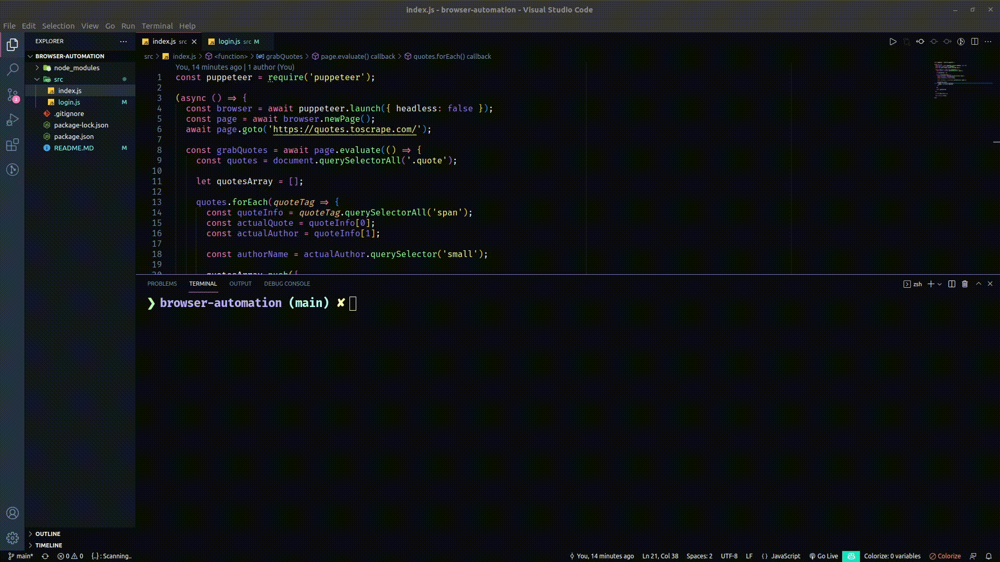
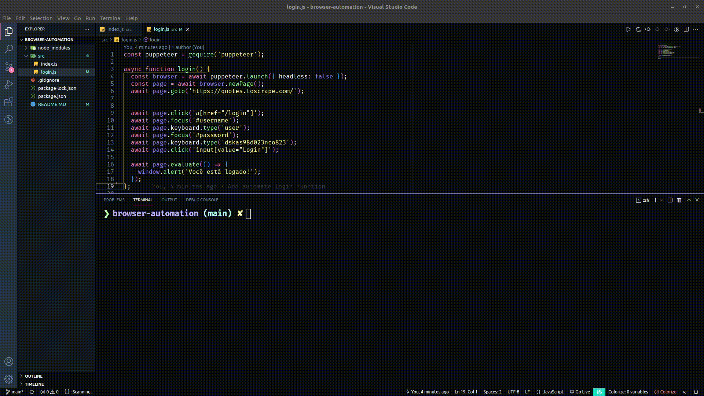

## Descrição

Repositório destinado a automação Web, utilizando a linguagem JavaScript e a biblioteca Puppeteer

## Implementações

- [x] Extrair dados do site e formar um objeto identificando cada Quote e cada Author

- [x] Criar um bot que faz login no site - preenche o formulário e clica no botão de login. Após isso, emite um alerta no browser dizendo que o usuário foi autenticado.

## Funcionamento da Aplicação

Abaixo uma pequena demostração do bot extraindo os dados e fazendo login no site.

  
  
  

  
  

## Desenvolvimento

Aplicação desenvolvida durante estudos de automação Web com JavaScript. 

Desenvolvido por <a href="https://www.linkedin.com/in/soaresmilton/"> Milton Soares </a>

## Get in touch 👇🏽

